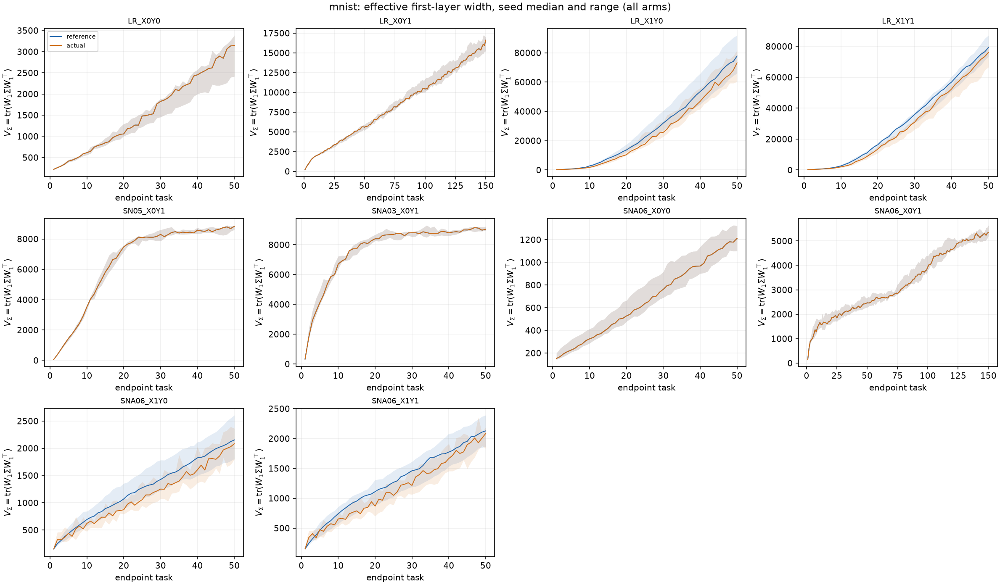
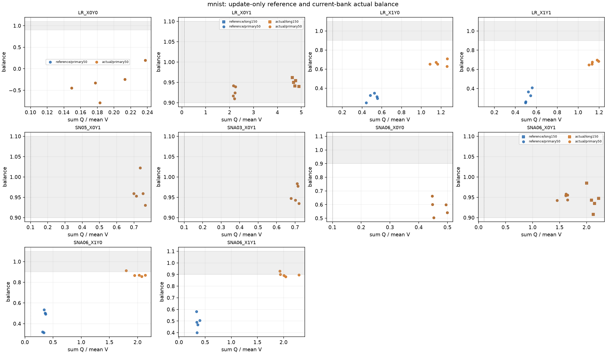

# 実効変位と幅：入力分布と標的変化を分けた再検証

状態: **全130系列を完了**。2026-09-24、`effdisp_inputscope_0924`。
数値正本は [数値詳細](補助データ/実効変位_入力分布_全結果_0924/summary.md)・[判定表](補助データ/実効変位_入力分布_全結果_0924/verdict.csv)。先に公開したleaky限定60系列と質問への事後解析は [[実効変位_入力分布を分けた再検証_leaky先行結果_0924]] に凍結保存した。

## 結論

入力を固定しても、leakyと通常の適応Snake c=.6では、今回の期間内に実効幅の頭打ちは確認できなかった。固定Snake α=.05はMNISTの50課題で頭打ち基準を4/5 seedが通過したが、前半の一定係数から後半の幅を予測する基準は0/5だった。

したがって、収支の恒等式と近い相殺は成立する一方、**一定のDとcで決まる普遍的な固定点・独立な長期予測という強い主張は支持されない**。有限期間の不通過は、無限時間での発散や収束の不存在の証明ではない。

ここでSnakeのc=.6/.3は活性化の適応係数。以下の収支のcは重みと変位の角度であり、別の量である。

## 何を分離したか

| 符号   | 入力X | 標的Y |
| ---- | --- | --- |
| X0Y0 | 固定  | 固定  |
| X0Y1 | 固定  | 変更  |
| X1Y0 | 変更  | 固定  |
| X1Y1 | 変更  | 変更  |

- CondA: learnerのcontextとteacher評価用contextを独立に固定/変更。persistent bitの反転数k=1/7、leaky .1/適応Snake c=.6、各5seed、400課題×10,000更新。入力20bitのうちrandom 5bit、teacher100unit、learner100unit。Adam lr=.001、ε=1e−8、β=(.9,.999)、weight decayなし、状態resetなし。X0Y1は課題を知らせるcontextも除くので、純粋な平均移動だけへの介入ではない。
- MNIST: 同じ1,200画像bankでpixel permutationとrandom labelsの変更を分離。784→100→100→10、Adamは同設定、400epoch×75batch=30,000更新/課題。leaky/適応Snake c=.6の全4条件を50課題、X0Y1のみ150課題まで延長。固定Snake α=.05と適応c=.3のX0Y1を各50課題。各5seed。通常の10,000画像・真のラベルによるPMとは異なる制御実験。
- seed200–204、初期重み・画像bank・batch順などを対応させた。登録は `specs/spec_effdisp_inputscope_0924.md` と `_addendum_c06.md`。

## 入力固定・標的変更の結果

P1は有効な更新を伴う近い相殺、P2はそれに幅の頭打ち条件を足した判定。群の通過には4/5 seedが必要。傾きは二乗幅Vのlate log–log傾きのseed中央値であり、幅R=√Vの傾きではない。

| 環境・活性化                | 課題数 / late窓   | P1  | P2      |  Vの傾き | 前半からの予測P3 |
| --------------------- | ------------- | --- | ------- | ----: | --------- |
| MNIST leaky           | 50 / 41–50    | 5/5 | 0/5     |  .748 | 0/5       |
| MNIST leaky           | 150 / 121–150 | 5/5 | 0/5     | 1.192 | 0/5       |
| MNIST 適応Snake c=.6    | 50 / 41–50    | 5/5 | 0/5     |  .439 | 0/5       |
| MNIST 適応Snake c=.6    | 150 / 121–150 | 5/5 | 0/5     |  .447 | 0/5       |
| MNIST 適応Snake c=.3    | 50 / 41–50    | 5/5 | 3/5     |  .159 | 0/5       |
| MNIST 固定Snake α=.05   | 50 / 41–50    | 5/5 | **4/5** |  .113 | 0/5       |
| CondA leaky k1        | 400 / 321–400 | 0/5 | 0/5     |  .289 | 3/5       |
| CondA leaky k7        | 400 / 321–400 | 1/5 | 1/5     |  .256 | 2/5       |
| CondA 適応Snake c=.6 k1 | 400 / 321–400 | 0/5 | 0/5     | −.107 | 2/5       |
| CondA 適応Snake c=.6 k7 | 400 / 321–400 | 0/5 | 0/5     |  .339 | 0/5       |

出典: `verdict.csv` のmetric=`reference`、arm末尾=`X0Y1`、表記のwindow。P2は傾きだけの判定ではないので、傾きが小さくても相殺・活動条件により不通過となる。

### Snakeの適応が効いたと言えるか

MNIST X0Y1のlate41–50でc=.3のα中央値は両層.05、clip割合のseed中央値は両層1.0。固定α=.05もP2を4/5で通る。c=.3の頭打ち傾向を、適応機構そのものの効果とは切り分けられない。

c=.6では第一層αはlate41–50で.130、121–150で.088、clip割合はどちらも0。第二層は両窓でα=.05、clip割合1.0。第一層の適応を残した通常設定でも、50/150課題のP2は0/5だった。

これらは窓内値をseedごとに要約した後の5seed中央値。出典: `seed_summary.csv` のmnist/X0Y1/reference、`late_adaptive_alpha_*`。全130系列に登録したLOW_RESPONSEの発生はない。固定入力MNISTの各Snake条件ではlate訓練精度中央値は1.0で、課題を学習しつつ測った結果である。

## 事前予測との照合

- leakyの150課題でVの増加が50課題より減速する予測は外れた（傾き.748→1.192）。通常Snake c=.6の減速とP2通過の予測も外れた（.439→.447、P2は0/5）。
- 固定Snakeと適応c=.3は、late41–50の対応するRの比が.980、Dの比が1.008で近かった。ただし両方が群としてP2を通る結果ではなかった。出典: `paired_group.csv`、design=`fixed_SN05_minus_adaptive_SNA03`、metric=`reference`、contrast=`ratio`、field=`late_mean_sigma`/`late_mean_sqrtQ`。近さに数値の合否閾値は事前登録していないので、新たなPASS判定は作らない。
- MNIST X1の環境項は観測上無視できない。referenceのP1とactualのA_BALANCEはSnakeの一部seedで異なったが、どちらもX1条件の群PASSには至らなかった。下節に量を示す。
- 入力・標的を両方固定したX0Y0では、MNISTのlate課題内accuracy gain中央値は0、CondAのMSE gainは約−1e−6。性能変化が小さくなる方向は確認した。これは新しい標的への学習不能の判定ではない。
- SCRのX0で平均切替項が0になる点は設計上の恒等関係であり、科学的な予測成功には数えない。入力変化を測り直しても、前回の不成立が全て解消する結果にはならなかった。

## 入力分布が変わる点を含めた判定

固定した共分散Σでは、V=tr(WΣWᵀ)、Q=tr(DΣDᵀ)、X=tr(WΣDᵀ)として

    ΔV = Q + 2X.

実際の課題ごとの共分散が変わる場合、現在のΣで更新を測る帳簿は

    ΔV_actual = Q_current + 2X_current + G_pre,
    G_pre = tr[W_prev(Σ_current−Σ_prev)W_prevᵀ].

CondAはcontextによって平均が変わるが、random bitの位置が同じなら中心化共分散は変わらない。MNISTのpermutationは共分散の固有値を保っても、重みとの相対的な向きを変える。両者の平均・bias・同じ潜在入力IDに対する前活性の変化を別途保存した。共分散帳簿だけでcontext変化を消したことにはしない。

例としてMNIST leaky X1Y1のlate41–50では、更新だけの相殺比−2ΣX/ΣQのseed中央値は1.443でも、入力変更項ΣG/ΣQは+.770。環境項を含めた相殺比−Σ(2X+G)/ΣQは.676で、A_PLATEAUは0/5となる。各比の中央値は別々に取るため、その差が厳密に一致するわけではない。

出典: `seed_summary.csv` のmnist/LR_X1Y1/primary50/actual、`late_update_only_balance`・`late_G_pre_over_Q`・`late_A_balance`、判定は`verdict.csv`。実入力でのA_PLATEAUも、群として通ったのは固定Snake α=.05のX0Y1だけだった。

## D/(2|c|)と収束について

- c<0の同じ更新でR*=D/(2|c|)を作ると、R/R*=−2X/Q。近さは恒等式の書き換えなので、独立な予測成功とは数えない。c≥0にはこの正の釣り合い点はない。
- leakyの固定入力MNISTでは、task41–50→121–150でDが+42%、|c|が−13%、R*が+65%、Rが+68%だった。**釣り合いの目安自体が動いていた**。質問に応じた事後解析であり、登録予測とは区別する。
- 元の0923 RL-CIFARも元CSVで照合すると、AdamのP1は10/10だがP2は0/10。完全な停止は確認できなかった。CondA・SGDも先行100課題ではP1/P2が0/5。詳細・窓・出典は[[実効変位_入力分布を分けた再検証_leaky先行結果_0924]]。
- [[実効変位_入力分布と動く釣り合い点_理論_0924|条件付き理論]]に、動くΣの正確な分解、動く釣り合い点、期待値が収束する簡単な模型、Adamの更新上界からの条件付き有界性を記した。後者は「幅が大きいとき全ての更新が一様に削る」という未検証の仮定を要し、今回のRLの収束を証明しない。

## 再現と保存

- 解析・理論commit: `1a19eedc9ba848a75ba2c3af09bf22efc40c4ae0`。全130系列、106,500遷移、結合テスト16件通過。
- 訓練commit: `0277e4db04e6d09efd5c9ae9b4992e9289636781`。登録commit: `2e9f878`・`cee50cc`。
- 生データ・全状態・ログ・独立監査: `/home/issan/Projects/obsidian-research-data/effdisp_inputscope_0924/`。全系列の完了は`DONE.json`と`completion.csv`。
- 解析: `OPENBLAS_NUM_THREADS=2 OMP_NUM_THREADS=2 python3 analysis/effdisp_inputscope_0924/analyze.py`。
- `transitions.csv.gz`は課題ごとの全帳簿。`seed_summary.csv`、`paired_seed.csv`、`paired_group.csv`は窓と対応seedの集計。`source_paths.csv`・`source_windows.csv`・`spec_hashes.csv`に出典と窓を保存。
- `non_snake_interim/`は先行公開時のスナップショットであり、今回の全体判定の代わりには使わない。
- 画像のRGB32・複製64・複製/2・灰色32・縮小16 × Adam/SGDは別実験`effdisp_imagegeom_0924`で実行中。この報告に未完了の結果を混ぜていない。

## Vaultとコード正本

- 事前登録: [[実効変位_入力分布と標的変化を分ける_予測_0924]]。
- 先行検証: [[実効変位と幅_環境と活性化を跨ぐ検証_結果_0924]]。
- 画像比較の登録: [[実効変位_画像の次元と分散を分ける_予測_0924]]。
- [全結果・全図と解析ファイル](https://github.com/Issan0511/lop_analysis/tree/7b7f0290da584c46fbf47980664109c47c60dcc6/results/effdisp_inputscope_0924)。
- このノートの図・集計CSVは `補助データ/実効変位_入力分布_全結果_0924/`、出所とSHA256は同フォルダの`snapshot_manifest.json`。
