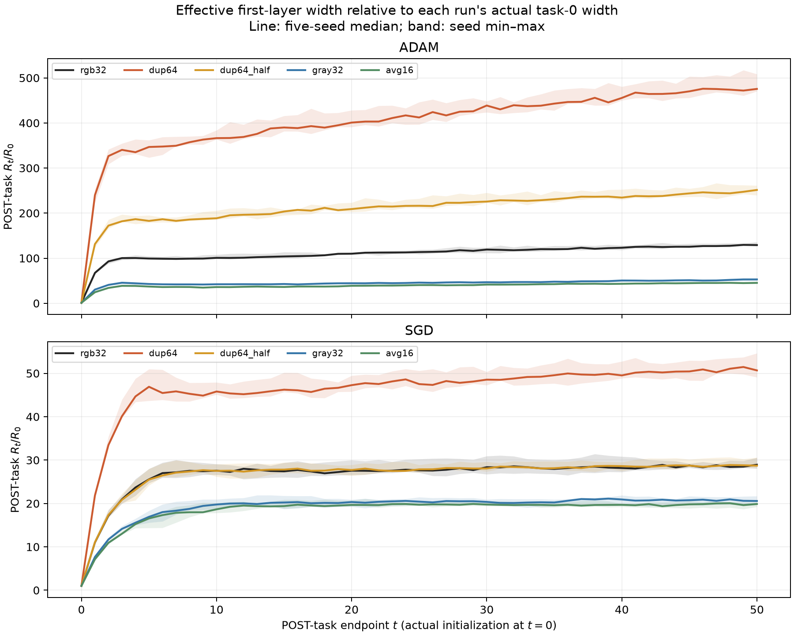

# 実効変位：画像の次元と分散を分ける — 全結果0924

**全50系列完了。実測初期幅からの成長倍率で比較しても、16×16は32×32より小さい。** 50課題終了時の対応seed比はAdam **0.350**、SGD **0.688**。一方、情報と共分散の非零スペクトルを保つ画素複製/2ではSGD **1.001**、Adam **1.922**だった。入力の分散方向だけで幅は決まらず、optimizerが作る更新も効く。

これは有限時点の比較である。近似的な供給・削りのバランスP1は全条件で通ったが、頭打ちP2と独立予測P3まで普遍的に成立したわけではない。

## 1. 条件と由来

- CIFAR10のseed別固定1200画像bank、raw01・標準化なし。各課題で新しい乱数ラベル。画像ID・ラベル・batch順は同じseedの条件間で共有。
- leaky .1、d→100→100→10。Adam lr=.001, β=(.9,.999), ε=1e−8／SGD lr=.01・momentumなし。weight decayなし、optimizer状態持越し。
- seed300–304、5画像条件×2optimizer×5seed=50系列。各50課題×30000更新。ローカルGPU、全系列COMPLETED、DIVERGEDなし。
- 画像条件はRGB32 (d3072)、nearest2×2複製64 (12288)、複製/2 (12288)、gray32 (.299R+.587G+.114B、1024)、非重複2×2平均16 (768)。実際に各入力次元で訓練した。
- 複製2条件は第一層の重み写像で初期関数をRGB32と一致させる。gray/avgはnative fan-in初期化で初期関数が異なる。同じ学習率で、次元に合わせた追加学習率対照は今回に含まれない。
- 登録commit `6fb5151`、訓練source `273c3fa3b52dc0c954eaaa58a4e711183c259770`。本走2026-09-24 11:23–18:20 JST（途中約10分の優先16×16実行を含む）。

## 2. 実測した初期幅から何倍になったか

ユーザー指定の事後比較。実効幅 RΣ(W)=√tr(WΣWᵀ) を、各系列の実測初期幅RΣ(W0)で割る。下表は課題50**終了後**。まずseedごとに倍率を求め、次に5seedの中央値を取った。RGB比は対応seedの倍率どうしの比を取ってから集約するので、独立に集約した中央値どうしの商とは必ずしも一致しない。

| 画像条件 | Adam 初期幅から | Adam 成長倍率のRGB比 | SGD 初期幅から | SGD 成長倍率のRGB比 |
| --- | --- | --- | --- | --- |
| RGB32 | 129.13倍 | 1.000 | 28.93倍 | 1.000 |
| 64×64画素複製 | 475.50倍 | 3.682 | 50.67倍 | 1.787 |
| 64×64複製・画素値÷2 | 251.37倍 | 1.922 | 28.71倍 | 1.001 |
| 32×32グレースケール | 52.92倍 | 0.402 | 20.57倍 | 0.713 |
| 16×16ブロック平均 | 45.23倍 | 0.350 | 19.87倍 | 0.688 |

初期幅の中央値はRGB32と複製2条件で1.454、gray32で1.352、avg16で1.374。**16×16の初期幅は元画像と近く、最初から幅が小さかった分だけでは学習後の差を説明できない。** 課題41–50の各終了後の幅をseed内で集約しても、16×16の成長倍率比はAdam0.353、SGD0.696。

ただし初期幅を揃えた比較でも、初期関数・スペクトル・更新・到達精度まで揃うわけではない。初期幅で割る比較は記述的な成長率を比較するもので、次元だけの因果効果を分離するものではない。

数値: `posthoc_normalization/growth_POSTtask_*.csv`。登録したRは更新前、ここは終了後を明示しており、1課題のずれを混同しない。

## 3. 登録窓での幅・変位・学習精度

late41–50。各課題開始側のRと、その課題の変位Dを同じ固定bank共分散で計算。seed内10課題の中央値→対応seed RGB比→5seed中央値。精度は各課題終了時の訓練精度のseed内中央値→5seed中央値で、汎化精度ではない。

| 画像条件 | Adam R比 | Adam D比 | Adam訓練精度 | SGD R比 | SGD D比 | SGD訓練精度 |
| --- | --- | --- | --- | --- | --- | --- |
| RGB32 | 1.000 | 1.000 | 99.6% | 1.000 | 1.000 | 73.7% |
| 64×64画素複製 | 3.720 | 3.726 | 99.5% | 1.764 | 2.021 | 87.3% |
| 64×64複製・画素値÷2 | 1.931 | 1.930 | 99.3% | 1.017 | 0.994 | 73.9% |
| 32×32グレースケール | 0.375 | 0.364 | 94.7% | 0.689 | 0.575 | 53.8% |
| 16×16ブロック平均 | 0.334 | 0.315 | 89.8% | 0.658 | 0.510 | 47.4% |

16×16は両optimizerで未正規化の実効幅・変位が小さい一方、学習精度も低い。幅の縮小を圧縮による情報損失だけの効果と断定しない。Adamの固定学習率・raw01で得た倍率を、以前の標準化CIFARや別の入力次元へそのまま移さない。

## 4. 次元補正についての訂正

先行説明のR比0.334/0.658は**未正規化の実効幅**だった。その時点で補正していたのは重みRMSだけで、実効幅まで次元補正済みのように説明した点を訂正する。以下はユーザーの指摘に応じた事後集計で、登録判定は変更しない。

| 画像条件 | optimizer | R/√d のRGB比 | R/√trΣ のRGB比 | 重みRMS比 | 整列A比 |
| --- | --- | --- | --- | --- | --- |
| 64×64画素複製 | adam | 1.860 | 1.860 | 0.960 | 1.933 |
| 64×64画素複製 | sgd | 0.882 | 0.882 | 0.558 | 1.591 |
| 64×64複製・画素値÷2 | adam | 0.966 | 1.931 | 0.988 | 1.969 |
| 64×64複製・画素値÷2 | sgd | 0.508 | 1.017 | 0.505 | 2.003 |
| 32×32グレースケール | adam | 0.650 | 0.681 | 1.020 | 0.672 |
| 32×32グレースケール | sgd | 1.194 | 1.246 | 1.514 | 0.826 |
| 16×16ブロック平均 | adam | 0.668 | 0.692 | 1.008 | 0.692 |
| 16×16ブロック平均 | sgd | 1.316 | 1.362 | 1.635 | 0.836 |

√dで割る基準ではavg16のAdamは約33%小さいが、SGDは約32%大きい。実際の入力総分散で割っても方向は同じ。ただし**√dは各座標の重み振幅を一定とする比較基準**であり、普遍的な因果補正でも初期化基準でもない。native fan-in初期化では E[R0²]=h trΣ/(3d) であり、avg16の期待二乗幅から求める初期幅比は約0.966になる。実際の初期幅基準の結果は§2を使う。

厳密な分解は R²=RMS(W)² h trΣ A²。各走でΣが固定なら R_t/R0=[RMS(W_t)/RMS(W0)]×[A_t/A0] で入力総分散因子は相殺する。これらはsnapshotごとの恒等式で、別々の中央値の積には使わない。理論と定義は `../../docs/effdisp_imagegeom_0924_theory.md` と `posthoc_normalization/definitions.json`。

## 5. 予測の結果と収束について

| 登録予測 | 結果 |
| --- | --- |
| E1: 複製/2のSGD、late R・D比が各.8–1.2 | PASS、5/5 |
| E2: 複製/2のAdam、early D比>1.2 | PASS、5/5 |
| E3: 生の複製、両optimizerでearly D比>1 | PASS、各5/5 |
| E4: gray/avgの方向 | 事前指定なし、報告のみ |
| E5: 全画像条件でlate cのRGB差が±.05以内 | FAIL。avg16 SGDは1/5のみ範囲内、対応差中央値+0.0584 |

P1の近似バランスは全10条件で5/5。P2の有限窓頭打ち判定は以下。群の通過基準は4/5seed以上。

| 画像条件 | Adam P2 | SGD P2 |
| --- | --- | --- |
| RGB32 | FAIL (0/5) | PASS (4/5) |
| 64×64画素複製 | FAIL (0/5) | FAIL (1/5) |
| 64×64複製・画素値÷2 | FAIL (0/5) | FAIL (3/5) |
| 32×32グレースケール | FAIL (0/5) | FAIL (3/5) |
| 16×16ブロック平均 | FAIL (1/5) | PASS (4/5) |

P3の前半校正→後半独立予測は群として通過なし。RGB SGDは5seed中4seedがUNINFORMATIVEで群判定も情報不足、他はFAIL。P4の生の重みと実効幅の傾向分離基準はRGB SGDのみ4/5でSEPARATED、他は未確立。詳細は `verdicts.csv` と `summary.md`。

**P1が通ることは固定したD/(2|c|)への収束を意味しない。** 同時点のD,cから作る局所比は幅変化の恒等式に近く、独立な予測ではない。D,cが課題や状態で変わるなら釣り合いの目安も動く。P2通過も50課題末の有限窓の基準であり、漸近収束や固定点の高さを確定しない。不通過から無限発散も断定しない。

## 6. 分散と最適化器の理論的な読み方

実効変位は DΣ²=Σ_j λ_j‖ΔW u_j‖²。固有値だけでなく更新がどの方向を向くかに依存する。複製/2は非零固有値を保つが、同じ学習率のAdamでは対応状態での第一層の関数更新がεを無視できると約2倍になる。SGDは同条件で関数軌道が実数演算上同じ。観測した成長倍率1.922/1.001はこの違いと整合するが、長時間の倍率を2と保証する定理ではない。

元の関数軌道を保つ第一層Adam対照はq回複製・画素倍率sに対してη'=η/(qs)、ε'=sε。今回この学習率対照は実行していない。下流層は元設定のまま、という条件を含む。

2×2平均を元座標へ再複製した直交射影の分散保持率は4trΣavg/trΣrgb=0.9324（対応seed中央値）。座標の縮尺が異なるtrace比0.2331を「77%の画像分散が消失」とは解釈しない。保持分散93.24%もラベル情報保持率ではない。

## 7. 再現性・保存物

- 全50系列、2500遷移。第一層V,Q,Xは保存したbankの中心化射影をfloat64で計算。共分散を作る入力bankは各走で固定。
- 全6種類の元図、登録判定、seed別値、窓比較、source SHAは `analysis_metadata.json`、`source_manifest.csv` 等。事後正規化と初期幅倍率には別の定義・audit・SHAを付けた。
- 優先16×16と本走のAdam/SGD×5seed×task0–50、510 snapshot・10,710キー配列はすべてbitwise一致、最大差0。`priority_avg16_snapshot_reproduction.json`。優先走は追加の独立seedとして数えず、本走50系列を最終集計とした。
- 本走の恒等式絶対残差最大5.39e−10。恒等式の一致は算術監査であり、予測成功の証拠ではない。
- 生データ正本: `/home/issan/Projects/obsidian-research-data/effdisp_imagegeom_0924/`。全ファイルの保存先・bytes・SHAは `backup_manifest.json`。
- `interim_task30/` と `priority_avg16/` の先行集計を保持し、今回の全50系列結果と混同しない。
- 広い環境・活性化の結果は `../effdisp_validation_0924/README.md`、入力分布と標的変化を分離した再検証は `../effdisp_inputscope_0924/README.md`。

## Vaultの数値正本と関連

[登録判定](補助データ/実効変位_画像次元_全結果_0924/verdicts.csv)、[初期幅からの成長倍率](補助データ/実効変位_画像次元_全結果_0924/posthoc_normalization/growth_POSTtask_groups.csv)、[条件別の倍率](補助データ/実効変位_画像次元_全結果_0924/posthoc_normalization/growth_POSTtask_absolute_groups.csv)。
理論: [[実効変位_画像次元と初期幅_理論_0924]]。登録: [[実効変位_画像の次元と分散を分ける_予測_0924]]。
先行結果: [[実効変位_画像圧縮16x16_先行結果_0924]]、[[実効変位_画像比較_途中task30_0924]]。
他の環境: [[実効変位_入力分布を分けた再検証_全結果_0924]]、[[実効変位と幅_環境と活性化を跨ぐ検証_結果_0924]]。
